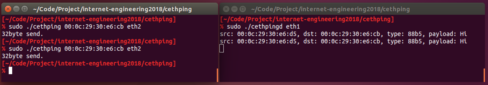

# cethping

Raw socketで通信。[ethping](https://github.com/y-sira/pyng)を参考。


Environment
-------

- Ubuntu14.04

## Usage

### Server


```bash
sudo cethpingd $INTERFACE_NAME
```

### Client

```bash
sudo cethping $DESTINATION_MAC_ADDRESS $SOURCE_INTERFACE_NAME
```


Screen shot
-------


